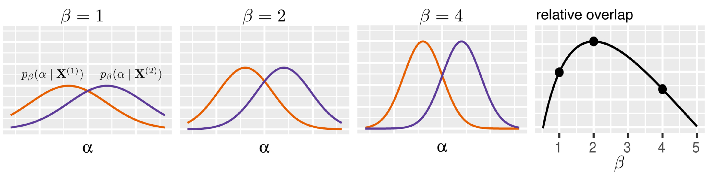
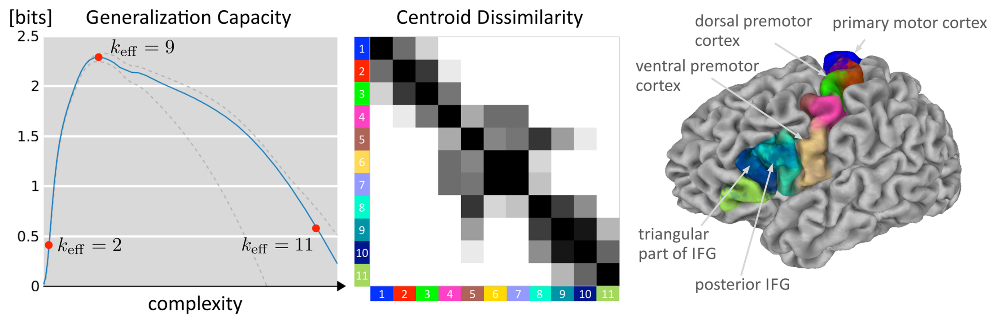

# Validation for Connectivity-based Cortex Parcellation by Posterior Agreement

Author: **Nico Stephan Gorbach**

<h2 align="center"></h2>

  <a href="https://ngorbach.github.io/Validation_for_Connectivity-based_Cortex_Parcellation/"><b>code documentation</b></a> |
  <a href="https://www.research-collection.ethz.ch/handle/20.500.11850/261734"><b>doctoral thesis</b></a> 
 

## Contents

Sample code for the paper **Pipeline Validation for Connectivity-based Cortex Parcellation** by Nico S. Gorbach, Marc Tittgemeyer and Joachim M. Buhmann (in submission). The doctoral thesis https://www.research-collection.ethz.ch/handle/20.500.11850/261734 contains more detailed descriptions and derivations.

Run the Matlab script *main_cortex_parcellation.m* in the *empirical* folder or one of the Matlab scripts *main_1D_connectivity*, *main_probability_simplex* or *main_anatomical_context* in the subfolders contained in the *simulations* folder. The Matlab image processing toolbox is required.

Sample Result
=======
